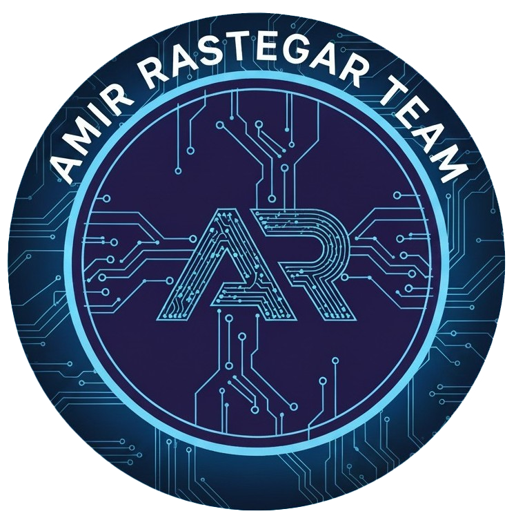

  
  <!-- TEAM LOGO -->
  <!-- Please upload your logo image as 'logo.png' to your repository root -->
  

    

  <h1 align="center">Amir Rastegar</h1>
  
  <h3>🚀 Lead Algorithmic Developer | Engineering Team Lead</h3>
  
  

    <b>Python Developer</b> with <b>3+ years</b> of experience in algorithmic trading, data science, and mathematical modeling.
     
    I specialize in designing high-performance trading systems, strategy optimization, and leading engineering teams.
     
    Currently transitioning from MetaTrader-based methods to <b>AI & Machine Learning</b> driven models.
  

   

  <!-- Social Links -->
  

    
    
    
    
    <!-- Add LinkedIn URL here if available -->
    <!--  -->
  

### 💼 Professional Experience

#### **Lead Algorithmic Developer (Freelance)** _(Nov 2023 – Present)_
*   🚀 **Team Leadership:** Led a 4-person engineering team developing modular trading bots.
*   🤖 **Bot Development:** Created **35+ MT5 bots** (MQL5) and **15+ TradingView indicators**.
*   🔗 **Exchange Integration:** Integrated APIs for **BingX** and **LBank** for automated trading.
*   ⚡ **Optimization:** Improved bot precision by **30%** via risk management strategies and code optimization (`flake8`, `Black`).
*   📉 **Systems:** Developed Renko and Market Depth-based systems for **NinjaTrader (C#)**.

#### **Quant Strategy Developer (Balinex Exchange)** _(Mar 2022 – Mar 2023)_
*   📈 **Strategy Design:** Designed crypto trading strategies using **Python** & **MQL5**.
*   💰 **Performance:** Achieved **50%+ ROI improvement** and **300% backtest growth** using Price Action (OB, FVG, ICT).

 

### 🛠️ Tech Stack & Skills

  
  **Languages & Frameworks**
   
  
  
  
  
  

   
  
  **Data Science & Tools**
   
  
  
  
  

   

  **Trading Concepts**
   
  
  
  
  

 

### 🔭 Featured Projects

| Project | Description | Tech Stack |
| :--- | :--- | :--- |
| **🧠 [Inner Trader Coach](https://github.com/Inner-Trader-Coach)** | Smart trading assistant and psychology tools for traders. | `Python` |
| **📉 [Levels Strategy](https://github.com/AmirRRA/Levels)** | Advanced trading strategy developed for **NinjaTrader 8**. | `C#` |
| **🤖 [Crypto Trader Bot](https://github.com/Qutex-Algotrader/Trader-Bot)** | Dedicated trading robot for Qutex exchange integration. | `Python` |
| **🔥 [Smart Home Backend](https://github.com/Home-Temputure/Backend)** | Secure backend server for IoT heating control (Designed & Managed). | `Python` |
| **💹 [SMC Project](https://github.com/pouyans95/SMC)** | Smart Money Concepts implementation for MetaTrader. | `MQL5` |

 

### 📊 GitHub Stats

  <!-- Custom Colored Stats to match Team Logo (Dark Blue & Cyan) -->
  
  <!-- General Stats -->
  
  
  <!-- Top Languages -->
  

 

<!-- Streak Stats -->

  

